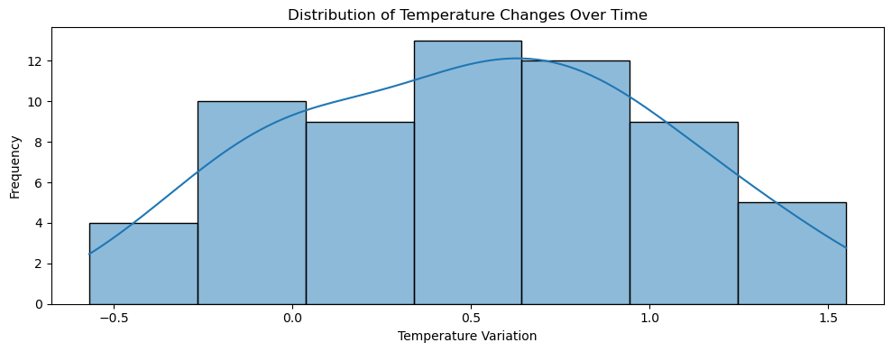
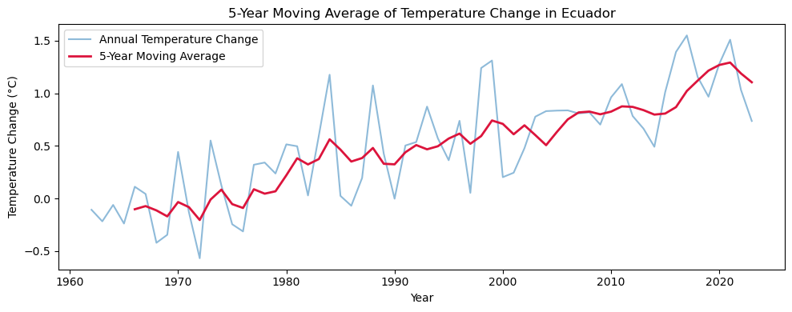
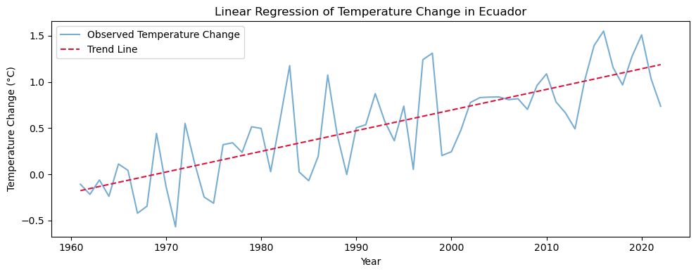
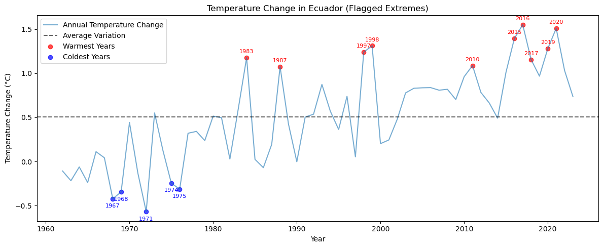
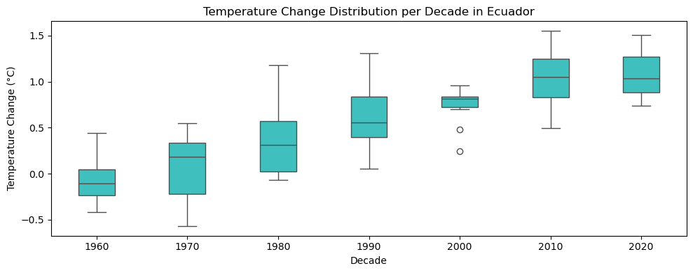
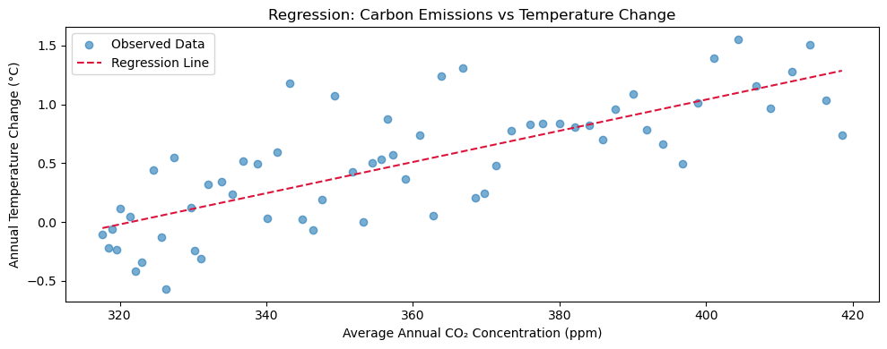

# 🌍 Global Analysis: Atmospheric CO₂ Trends (1958–2024)
The `carbon_emisions.ipynb` notebook explores the long-term evolution of atmospheric carbon dioxide concentrations, drawing from monthly data spanning over six decades. The analysis reveals a story of steady, structured growth.

## ✔️ Findings
- After cleaning the dataset to remove duplicate entries and a single outlier, the time series was prepared for deeper exploration. The data shows a clear upward trajectory: **CO₂ levels have risen from around 315 ppm in the late 1950s to over 420 ppm in the 2020s**. This increase is not random, it is persistent.

  

- **Monthly percentage changes**, while typically small, tend to be positive, showing a slow but compounding rise.

  

- **Seasonal decomposition** confirms a strong annual cycle: concentrations peak mid-year and decrease toward the end, reflecting biospheric processes like plant growth and decay.

  

- When **broken down by decade**, the shift becomes even more striking. Each ten-year slice shows higher medians, wider ranges, and elevated minimums—evidence of a system that’s not just fluctuating, but fundamentally changing. For example, the median CO₂ level in the 1960s was around 320 ppm; by the 2010s, it had climbed past 400 ppm.

  

- **Seasonal patterns** add another layer of insight. Winter months consistently show the highest concentrations, while autumn tends to be the lowest. This rhythm aligns with natural carbon cycles, reinforcing the ecological underpinnings of the data.

  

In sum, the global analysis paints a clear picture: atmospheric CO₂ is rising, steadily and structurally. The changes are subtle month to month, but very distinctive across decades. This foundation sets the stage for more localized investigations, including Ecuador’s emissions and temperature trends.

---

# 🌡️ Temperature Trends in Ecuador (1961–2022)
The `temperature.ipynb` file analyzes Ecuador’s annual surface temperature changes over six decades, revealing a clear and accelerating warming trend. The data, drawn from global climate records, is cleaned and structured to highlight both statistical properties and long-term behavior.

## ✔️ Findings
- The **distribution of temperature changes** is nearly symmetric, with a mean of 0.5 °C and a median of 0.51 °C. These values suggest moderate warming across most years, with relatively stable variation. A normality test supports this interpretation, indicating that the fluctuations are not extreme or erratic.

  

- Visualizations show a steady rise in temperature beginning in the early 1990s. A **5-year moving average** smooths short-term noise and emphasizes the persistent upward trajectory.

  

- **Linear regression** confirms this trend: Ecuador has warmed at a rate of approximately 0.0224 °C per year, or 0.22 °C per decade, with over 60% of the variation explained by time alone.

  

- **Anomaly detection** flags the warmest years—2016, 2020, and 2015—as significantly above the long-term mean, often coinciding with El Niño events. The coldest years, clustered in the 1960s and 1970s, reinforce the shift toward consistently warmer conditions in recent decades.

  

- **Decadal boxplots** reveal rising medians and broader spreads over time, suggesting not only higher average temperatures but also greater volatility. Outliers become more frequent in recent decades, pointing to an increase in extreme temperature events.

  

- Finally, **regression models linking atmospheric CO₂ concentrations to temperature change** show a strong and statistically significant relationship. Each additional ppm of CO₂ corresponds to roughly 0.013 °C of warming, with R² values near 0.59. This confirms that Ecuador’s warming is closely tied to global carbon buildup, reinforcing the patterns observed in the global analysis.

  

---
