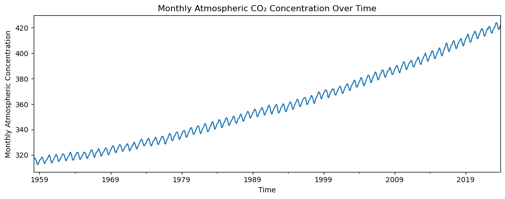
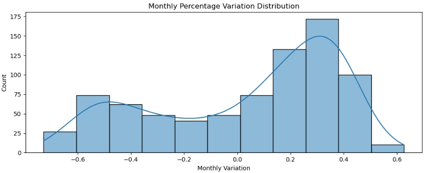
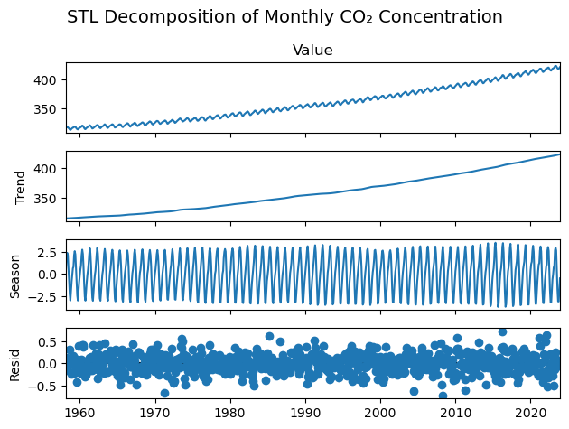
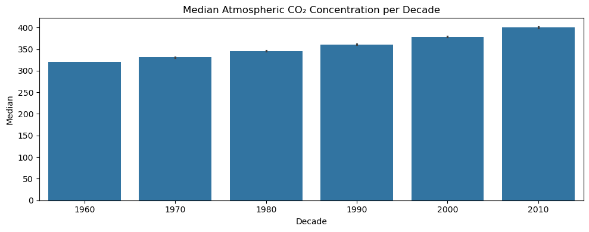
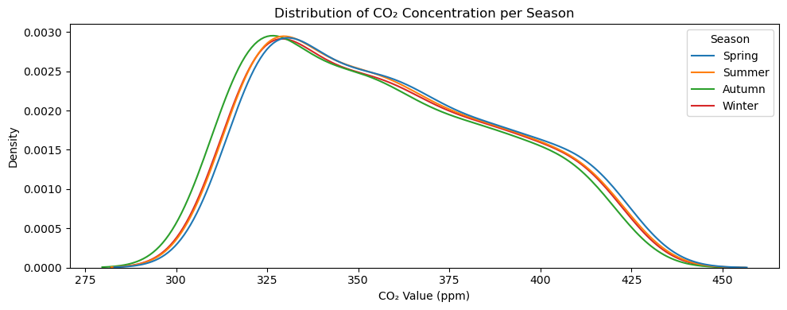

# 🌍 Global Analysis: Atmospheric CO₂ Trends (1958–2024)
The `carbon_emisions.ipynb` notebook explores the long-term evolution of atmospheric carbon dioxide concentrations, drawing from monthly data spanning over six decades. The analysis reveals a story of steady, structured growth.

## Findings
- After cleaning the dataset to remove duplicate entries and a single outlier, the time series was prepared for deeper exploration. The data shows a clear upward trajectory: **CO₂ levels have risen from around 315 ppm in the late 1950s to over 420 ppm in the 2020s**. This increase is not random, it is persistent.

  

- **Monthly percentage changes**, while typically small, tend to be positive, showing a slow but compounding rise.

  

- **Seasonal decomposition** confirms a strong annual cycle: concentrations peak mid-year and decrease toward the end, reflecting biospheric processes like plant growth and decay.

  

- When **broken down by decade**, the shift becomes even more striking. Each ten-year slice shows higher medians, wider ranges, and elevated minimums—evidence of a system that’s not just fluctuating, but fundamentally changing. For example, the median CO₂ level in the 1960s was around 320 ppm; by the 2010s, it had climbed past 400 ppm.

  

- **Seasonal patterns** add another layer of insight. Winter months consistently show the highest concentrations, while autumn tends to be the lowest. This rhythm aligns with natural carbon cycles, reinforcing the ecological underpinnings of the data.

  

In sum, the global analysis paints a clear picture: atmospheric CO₂ is rising, steadily and structurally. The changes are subtle month to month, but very distinctive across decades. This foundation sets the stage for more localized investigations, including Ecuador’s emissions and temperature trends.
